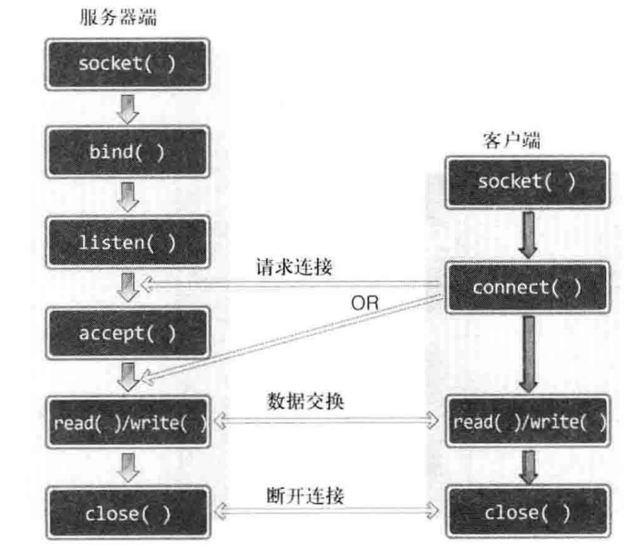

## TCP/IP 网络编程

### 服务器端

**1.创建套接字**
```c
/*
 * IPV4/IPV6 协议簇
 * TCP/UDP 协议
 * 返回值：套接字描述符
 */
int socket(int domain,int type,int protocol);
```

|domain|type|protocol|
|:---:|:---:|:---:|
|AF_INET|SOCK_STREAM|0|
|AF_INET6|SOCK_DGRAM|0|

---

**2.分配IP地址和端口号**
```c
/*
 * 套接字描述符
 * IP地址和端口号
 */
int bind(int sockfd,const struct sockaddr* addr,socklen_t addrlen);

//协议簇、端口号、IP地址
struct sockaddr_in {

    short int sin_family;

    unsigned short int sin_port;

    struct in_addr sin_addr;
};

//点分十进制IP地址转化为长整型数
//协议簇、端口号、IP地址
struct sockaddr_in {

    short int sin_family;

    unsigned short int sin_port;

    struct in_addr sin_addr;
};

//点分十进制IP地址转化为长整型数
in_addr_t inet_addr(const char *cp);

/*
 * 网络字节序转换(大端/小端 <-> 小端)
 * 主机 - 网络
 * 网络 - 主机
 */
uint32_t htonl(uint32_t hostlong);
uint16_t htons(uint16_t hostshort);
uint32_t ntohl(uint32_t netlong);
uint32_t ntohs(uint16_t netshort);

/*
 * 网络字节序转换(大端/小端 <-> 小端)
 * 主机 - 网络
 * 网络 - 主机
 */
uint32_t htonl(uint32_t hostlong);
uint16_t htons(uint16_t hostshort);
uint32_t ntohl(uint32_t netlong);
uint32_t ntohs(uint16_t netshort);

```

---

**3.监听连接请求**
```c
int listen(int sockfd,int backlog);
```
---

**4.建立连接**
```c
int accept(int sockfd,struct sockaddr* addr,socklen_t* addrlen);
```

**5.数据交换**
```c
ssize_t read(int fd,void *buf,size_t count);

ssize_t write(int fd,void *buf,size_t count);
```
---
**6.关闭连接**
```c
int close(int fd);
```
---

### 客户端

**1.创建套接字**
```c
int socket(int domain,int type,int protocol);
```
---
**2.请求连接**
```c
int connect(int sockfd,const struct sockaddr* addr,socklen_t addrlen);
```
---
**3.数据交换**
```c
ssize_t read(int fd,void *buf,size_t count);

ssize_t write(int fd,void *buf,size_t count);
```
----
**4.关闭连接**
```c
int close(int fd);
```
---
  

---
## 并发编程

### 多进程

**1.创建子进程**
```c
#include <unistd.h>
pid_t fork(void);
```
(1) child process copied from parent process,so they have same program and data.

(2) When program open a file,they shared the same file handler.

(3) 父子进程会在创建进程返回值处开始运行

**2.僵尸进程**

当子进程比父进程先运行结束时，由于父进程并没有清理子进程所遗留下来的资源（父进程并不知道子进程何时结束），此时该子进程会成为僵尸进程，当僵尸进程数量过多时，会影响系统进程的创建（进程号有限）。但父进程运行结束后，该僵尸进程会被销毁，因为父进程结束后会将所有遗留的子进程交给init进程，init进程会不断调用wait销毁僵尸进程

wait(),父进程阻塞直到子进程终止后，父进程销毁子进程，然后继续执行

waitpid(),可选进程与阻塞状态

何时阻塞？

阻塞后并发的意义？

```c
#include <sys/wait.h>

pid_t waitpid(pid_t pid,int *wstatus,int options);

options:
    WNOHANG 非阻塞方式退出

wstatus:
    返回子进程退出状态（正常退出/非正常退出）
```

**3.信号处理**

为了让父进程并不阻塞等待，使用信号处理，子进程退出后通知父进程，父进程使用非阻塞等待状态回收子进程资源
```c
#include <signal.h>

struct sigaction {
    void (*sa_handler)(int);
    void (*sa_sigaction)(int, siginfo_t *, void *);
    sigset_t sa_mask;
    int sa_flags;
    void (*sa_restorer)(void);
}
struct sigaction act;
act.sa_handler = handler;
act.sa_flags = 0;
sigemptyset(&act.sa_mask);

int sigaction(int signum, const struct sigaction *act,struct sigaction *oldact);

产生信号，信号处理函数
```
**4.管道**

进程间通信可以使用管道连接两个进程
```c
#include <unistd.h>

int pipe(int pipefd[2]);

pipefd[0] 管道接收口，pipefd[1] 管道发送口
```

### IO复用

1.初始化
2.注册事件
3.遍历查询事件变化（超时退出），原本与副本之间对比
4.执行相应处理

### 多线程
```c
#include <pthread.h>
//创建线程
int pthread_create(pthread_t *thread, const pthread_attr_t *attr,void *(*start_routine) (void *), void *arg);
//阻塞方式加入线程（创建线程退出时，main才能返回）
int pthread_join(pthread_t thread, void **retval);
//分离方式加入线程
int pthread_detach(pthread_t thread);

//互斥锁（保护共享数据）
pthread_mutex_t mutex;
//初始化互斥锁
int pthread_mutex_init(pthread_mutex_t *__mutex, const pthread_mutexattr_t *__mutexattr);
//上锁
int pthread_mutex_lock(pthread_mutex_t *__mutex);
//解锁
int pthread_mutex_unlock(pthread_mutex_t *__mutex);
```